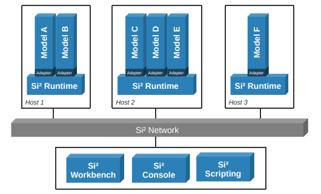
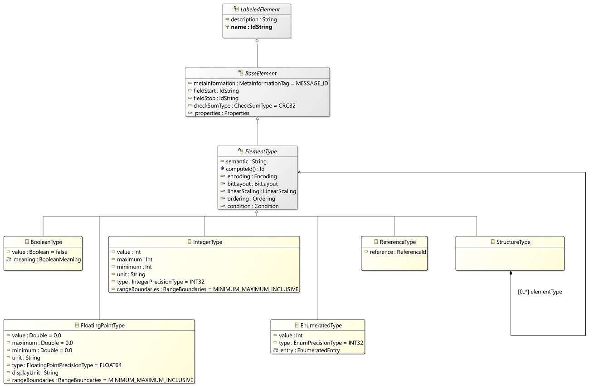
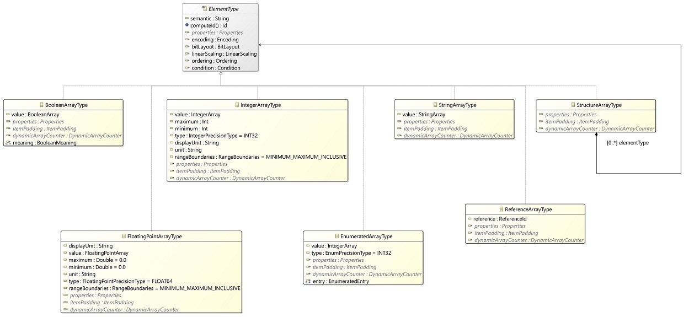

# Si² Icd Documentation

## Introduction

Si² ICD (Interface Control Document) files specify the interface of a simulation model and the connection to an integrated simulation network architecture. ICDs are furthermore used for describing in detail the data types and bit layout of the simulation variables and messages.

### Si² Simulation Framework

The Si² Simulation Framework is a set of tools and libraries to develop and execute simulations. Such simulations range from high-fidelity, full flight simulators to support crew training to interactive cockpit trainers and development simulations to support aircraft development, test and verification.

<div class="figure"></div>

Simulations are frequently used to support the development of complex and distributed systems and to train operators on how to use them. Today’s simulators are comprised of a number of off-the-shelf computers running various software models and equipment simulations connected through a standard network infrastructure. As the number of models and simulations increased over time, the focus has shifted from the development of new modules to the integration of existing or commercial-off-the-shelf or subcontracted modules. This created a significant demand for an integration platform like the Si² Simulation Framework to allow simulation developers and integrations to interconnect modules with minimum effort.

Hence, the Si² Simulation Framework is used to integrate, build and execute simulation products and services dedicated to product lifecycle. It is mostly composed of the Si² Runtime − a simulation execution environment − and the Si² Workbench − a simulation authoring and monitoring tool.

## Supported data types <a name="supported_data_types"/></a>

The following data types are supported:

* boolean -> `BooleanType` for modeling a boolean with values *true* and *false*.
* enum -> `EnumeratedType` for modeling enums with enum value / literal pairs.
* integer -> `IntegerType` for modeling integer types of precision *int8*, *int16*, *int32*, *int64*, *uint8*, *uint16*, *uint32* and *uint64*.
* float/double -> `FloatingPointType` for modeling float and double types of precision *float32* and *float64*.
* string -> `StringType` for modeling simple strings.
* struct -> `StructureType` for modeling structure types containing an ordered list of data types.
* reference -> `ReferenceType` for modeling reference types for reusing data type definitions.

The following image shows the main data types and the respective class relations.

<div class="figure"></div>

Furthermore, the following array types are supported:

* boolean array -> `BooleanArrayType`
* enum array -> `EnumeratedArrayType`
* integer array -> `IntegerArrayType`
* float array -> `FloatingPointArrayType`
* string array -> `StringArrayType`
* struct array -> `StructureArrayType`
* reference array -> `ReferenceArrayType`

<div class="figure"></div>

## General Data Types and Xml Examples

```xml
<?xml version="1.0" encoding="UTF-8"?>
<DataDefinition xmlns="http://www.airbus.com/si2/icd" name="data">
    <BooleanElement name="boolean" value="true"/>
    <FloatingPointElement name="doubleValue" value="5.0" maximum="10.0" unit=""/>
    <IntegerElement name="integerValue" value="1"/>
    <EnumeratedElement name="enumValue">
        <Entry name="on" value="1"/>
        <Entry name="off" value="0"/>
    </EnumeratedElement>
    <StructureElement name="structure">
        <StringElement name="string" dimensions="16"/>
    </StructureElement>
    <BooleanArrayElement name="booleanArray" dimensions="7"
        value="true false true false true true true"/>
    <IntegerArrayElement name="integerArray" dimensions="10"
        value="0 1 2 3 4 5 6 7 8 9"/>
    <EnumeratedArrayElement name="enumArray" dimensions="5" value="0 2 1 0 1">
        <Entry name="first" value="0"/>
        <Entry name="second" value="1"/>
        <Entry name="third" value="2"/>
    </EnumeratedArrayElement>
    <FloatingPointArrayElement name="doubleArray" dimensions="2 4"
        value="0.0 1.4 2.5 3.4 4.3 5.0 6.0 7.0"/>
    <StructureArrayElement name="array" dimensions="3">
        <FloatingPointElement name="float1"/>
        <FloatingPointElement name="float2" value="1"/>
        <FloatingPointElement name="float3" value="2"/>
        <FloatingPointElement name="float4" value="3"/>
    </StructureArrayElement>
</DataDefinition>
```

### Enumeration type

Enumeration types represent an enum with a list of literals and corresponding values.
Enum tags can be defined by adding *Entry* objects to the *EnumeratedElement*s.
The entry can define its literal using the *name* attribute and its numerical value using the *value* attribute.

```xml
<EnumeratedElement name="enumValue">
	<Entry name="on" value="1"/>
   <Entry name="off" value="0"/>
</EnumeratedElement>
```

### Integer and Floating Point types

Integer and floating point types represent the corresponding numeric data type. The numeric precision can be specified by setting the attribute *type*.
Precision types supported for *IntegerTypes* are

* INT8 - signed integer of bit size 8
* INT16 - signed integer of bit size 16
* INT32 - signed integer of bit size 32
* INT64 - signed integer of bit size 64
* UINT8 - unsigned integer of bit size 8
* UINT16 - unsigned integer of bit size 16
* UINT32 - unsigned integer of bit size 32
* UINT64 - unsigned integer of bit size 64

Precision types supported for *FLoatingPointTypes* are

* FLOAT32 - floating point of bit size 32
* FLOAT64 - double floating point of bit size 64

```xml
<FloatingPointElement name="doubleValue" value="5.0" minimum= "1.0" maximum="10.0" unit=""/>
<IntegerElement name="integerValue" value="1"/>
```

### Structured data

A *StructureElement* defines hierarchical data structures. Every element type can be added as child of a structure element.

```xml
<StructureElement name="structure">
	<BooleanElement name="boolean" value="true"/>
   <FloatingPointElement name="doubleValue" value="5.0" maximum="10.0" unit=""/>
   <IntegerElement name="integerValue" value="1"/>
</StructureElement>
```

### Defining references

A *ReferenceElement* can be specified to reuse a type declaration.

```xml
<StructureElement name="struct_t">
	<IntegerElement name="ui16" type="UINT16"/>
	<FloatingPointElement name="f64" type="FLOAT64"/>
</StructureElement>
<ReferenceElement name="struct1" reference="struct_t" />
<ReferenceElement name="struct2" reference="struct_t" />
<ReferenceElement name="struct3" reference="struct_t" />
```

In the above example, the type declaration of *struct_t* is instantiated three times as data types *struct1*, *struct2* and *struct3*. The avoids the need for redundant declarations in case of complex layouts.

### Defining bit layouts

The **bit layout** defines how data/payload is positioned inside messages of protocols. So, each protocol provides the possibility to define the layout of the message payload (signals) using the bit layout. Following code shows a bit layout example of ARINC 429 protocol.

```xml
<?xml version="1.0" encoding="UTF-8"?>
<Arinc429Protocol xmlns="http://www.airbus.com/si2/arinc429" 
	xmlns:icd="http://www.airbus.com/si2/icd" 
	schemaVersion="0.9.0" name="Arinc429_Bus" parity="ODD">
  <Message name="Arinc429_Message_101" label="101" ssm="BNR">
    <icd:BooleanElement name="messageEntry" value="false">
      <icd:Encoding encodingType="BIN"/>
      <icd:BitLayout bitLength="1" startBit="28"/>
    </icd:BooleanElement>
  </Message>
</Arinc429Protocol>
```

In Si², all positions (`startBit`, `startWord`) of `BitLayout` are 0-based. If a structured element is defined, all children of the structured element have positions related to their parent. If a word-based layout is defined, `startBit` is related to its `startWord`. Pre-padding of elements are included in `startBit`. Post-padding of elements can be defined using `postPadding` attribute.

Following code shows an example of word-based layout.

```xml
<?xml version="1.0" encoding="UTF-8"?>
<MilStd1553Protocol
  xmlns="http://www.airbus.com/si2/milstd1553"
  xmlns:icd="http://www.airbus.com/si2/icd" 
  schemaVersion="0.9.0"
  name="M1553Network" 
  revision="B">
  <icd:Security>
    <icd:Classification>TBD</icd:Classification>
  </icd:Security>
  <Terminals>
    <Terminal name="RT1_Port1" address="11" 
      type="BUS_CONTROLLER"/>
    <Terminal name="RT2_Port1" address="21"
      type="REMOTE_TERMINAL"/>
  </Terminals>
  <Message name="M1">
    <Route>
      <Transmitter address="11"/>
      <Receiver address="21" subAddress="1"/>
    </Route>
    <Signals>
      <icd:IntegerElement
        name="MESSAGE_1_WORD_0_INTEGER" type="INT16">
        <icd:Encoding encodingType="BNR"/>
        <icd:BitLayout bitLength="16" startWord="0" startBit="0"/>
        <icd:LinearScaling scalingFactor="1.0" scalingOffset="0.0"/>
      </icd:IntegerElement>
      <icd:IntegerElement
        name="MESSAGE_1_WORD_1_INTEGER" type="INT16">
        <icd:Encoding encodingType="BNR"/>
        <icd:BitLayout bitLength="16" startWord="1 startBit="0" "/>
        <icd:LinearScaling scalingFactor="1.0" scalingOffset="0.0"/>
      </icd:IntegerElement>
    </Signals>
  </Message>
</MilStd1553Protocol>
```

#### Bit Layout Type <a name="bit_layout_type"/></a>

There are 2 different bit layout types which can be specified using `type` attribute of `BitLayout`.

- FIXED (default): starting position is fixed. `startBit` attribute must be specified with a fixed bit position.
- DYNAMIC: starting position is calculated dynamically at transmission time. `startBit` attribute can be omitted or can be used to specify pre-padding bits.

Example:

```xml
<StructureElement name="structure">
  <BitLayout bitLength="328" startBit="0"/>
  <IntegerElement name="counter" type="UINT8">
    <BitLayout bitLength="8" startBit="0"/>
  </IntegerElement>
  <IntegerArrayElement name="array" dimensions="5" type="UINT8">
    <BitLayout bitLength="8" startBit="8"/>
    <DynamicArrayCounter element="counter" type="CARDINAL"/>
  </IntegerArrayElement>
  <IntegerElement name="signal" type="UINT8">
    <BitLayout bitLength="8" type="DYNAMIC"/>
  </IntegerElement>
</StructureElement>
```

#### Array Item Padding

Padding information of items of arrays can be set using `ItemPadding` element in array type elements in Si² ICD. The `preBitLength` and `postBitLength` attributes define the pre and post paddings around each array item.

Example of an array element with padding.

```xml
<!--Array has 2 items-->
<IntegerArrayElement name="array" dimensions="2">
  <!--Array starts at bit 0 and each item occupies 4 bits (without padding)-->
  <BitLayout startBit="0" bitLength="4"/>
  <!--Each item has 1 bit pre-padding and 1 bit post-padding-->
  <ItemPadding preBitLength="1" postBitLength="1"/>
</IntegerArrayElement>

<!--Next element-->
<IntegerElement name="sig">
  <BitLayout startBit="12" bitLength="4"/>
</IntegerElement>
```

### Presence Vectors and Variables

The presence of an element (including an entire structure) can be controlled using a presence vector or a presence variable.
The it is referenced using the element `Condition` under the conditional element (next to the `BitLayout` element).

```xml
<GenericProtocol xmlns="http://www.airbus.com/si2/icd" name="ExampleProtocol">
    <Message name="MessageType5">
        <BooleanArrayElement name="presenceVector" dimensions="8">
            <BitLayout bitLength="1" startBit="0"/>
        </BooleanArrayElement>
        <IntegerElement name="signal1">
            <Encoding encodingType="BIN"/>
            <BitLayout bitLength="16" startBit="8"/>
            <Condition element="presenceVector[0]" type="INCLUDE"/>
        </IntegerElement>
        <StructureElement name="data">
            <Condition element="presenceVector[1]" type="INCLUDE"/>
            <IntegerElement name="signal2" type="INT16">
                <Encoding encodingType="BIN"/>
                <BitLayout bitLength="8" startBit="24"/>
            </IntegerElement>
            <IntegerElement name="signal3" type="INT16">
                <Encoding encodingType="BIN"/>
                <BitLayout bitLength="16" startBit="32"/>
            </IntegerElement>
        </StructureElement>
    </Message>
</GenericProtocol>
```

An element referenced with the `element` attribute must not be conditional.
The bit layout of signals after a conditional element is shifted if the element is not present.

The attribute `type` can be set to `INCLUDE` (default) or `EXCLUDE`.

When it is set to `INCLUDE`, the conditional element is present in the message if the element referenced using the `element` attribute is not `0`.
When it is set to `EXCLUDE`, the conditional element is present in the message if the element referenced using the `element` attribute is `0`.

### Variable Arrays

It is possible to declare arrays of variable length (up to a pre-defined maximum) using the `DynamicArrayCounter` element (next to the `BitLayout` element).

There are 4 different types or modes, specified via the `type` attribute:
* `CARDINAL`: References another signal via the `name` attribute, which describes the actual number of elements this array contains
* `BITLENGTH`: References another signal via the `name` attribute, which describes the total amount of bits this array contains. This value has to be a multiple of the defined `bitLength` from the `BitLayout` element.
* `CONDITION`: Defines the size of the array up to and including the first occurence of the value described by the attribute `terminationValue`.
* `END_OF_DATA`: For this mode, the size is derived by the total message length, i.e. the variable array is always the last signal in a message and there can only be one variable array with this type.

The optional attribute `offset` is only specified for the `CARDINAL` type and allows to offset the referenced counter by a constant number, i.e. the the actual element count for the array is defined by the sum of the referenced signal value and the constant offset value.

Note that signals linked to an element with an DynamicArrayCounter of type `END_OF_DATA` do currently not propagate the size information from or to the models, i.e. currently all elements (dimension) get serialized into the message and there is no inherent mechanism to deduce the count/size of received data from within the model, unless by additional and application speific means.

```xml
<GenericProtocol name="ChannelProtocol" xmlns="http://www.airbus.com/si2/icd" xmlns:xsi="http://www.w3.org/2001/XMLSchema-instance">
    <Message name="Message">
        <IntegerElement name="variableArray_cardinal" type="UINT8">
            <Encoding encodingType="BIN" />
            <BitLayout bitLength="8" startBit="0" />
        </IntegerElement>
        <IntegerElement name="variableArray_bitlength" type="UINT8">
            <Encoding encodingType="BIN" />
            <BitLayout bitLength="8" startBit="16" />
        </IntegerElement>
        <IntegerArrayElement name="variableArray_array_cardinal" dimensions="10" type="UINT8">
            <BitLayout bitLength="8" startBit="24" />
            <DynamicArrayCounter element="variableArray_cardinal" offset="3" type="CARDINAL" />
        </IntegerArrayElement>
        <IntegerArrayElement name="variableArray_array_bitlength" dimensions="10" type="UINT8">
            <BitLayout bitLength="8" type="DYNAMIC" />
            <DynamicArrayCounter element="variableArray_bitlength" type="BITLENGTH" />
        </IntegerArrayElement>
        <IntegerArrayElement name="variableArray_array_condition" dimensions="10" type="UINT8">
            <BitLayout bitLength="8" type="DYNAMIC" />
            <DynamicArrayCounter type="CONDITION" terminationValue="7" />
        </IntegerArrayElement>
        <IntegerArrayElement name="variableArray_array_end_of_data" dimensions="10" type="UINT8">
            <BitLayout bitLength="8" type="DYNAMIC" />
            <DynamicArrayCounter type="END_OF_DATA"/>
        </IntegerArrayElement>
    </Message>
</GenericProtocol>
```
## Simulation specific Icds

### Global Simulation Data Description (GSDD)

GSDD files with the file extension `\*.gsdd` contain the definition of communication channels for data exchange between models and/or devices.
Multiple `Channel` elements can be defined within the `Channels` section.
There are three kinds of channels, which are defined using a `Channel` element:

* Signal channels: A signal channel is a channel with a definition of engineering signals, which can be exchange on the channel.
  The signals are declared under the `Channel` element and they can reference signals or structures from the `DataDefinition` file.
* Protocol channels: A protocol channel is a channel with an attached protocol description that describes the data exchanged on the channel.
* Message channels: A message channel is a channel without signals or a protocol. It can be used to exchange raw messages of arbitrary size.

#### Example of a signal channel description:

```xml
<?xml version="1.0" encoding="UTF-8"?>
<GlobalSimulationDataDescription xmlns="http://www.airbus.com/si2/icd" name="data">
    <Channels>
        <Channel name="channel1">
            <StructureElement name="struct">
                <IntegerElement name="int_signal" type="INT32"/>
            </StructureElement>
            <FloatingPointArrayElement name="float_signals" type="FLOAT64" dimensions="4"/>
        </Channel>
    </Channels>
</GlobalSimulationDataDescription>
```

It is also possible to define references to signals and messages that are already defined in the `Data-` `Definition` file.

```xml Data.dd
<?xml version="1.0" encoding="UTF-8"?>
<DataDefinition xmlns="http://www.airbus.com/si2/icd" name="Data">
    <StructureElement name="structure">
        <FloatingPointElement name="doubleSignal1"/>
        <FloatingPointElement name="doubleSignal2"/>
    </StructureElement>
</DataDefinition>
```

`GlobalSimulationDataDescription` refers to values within a structure declared in the `DataDefinition`.

```xml Example2.gsdd
<?xml version="1.0" encoding="UTF-8"?>
<GlobalSimulationDataDescription xmlns="http://www.airbus.com/si2/icd"
                                 name="GlobalSimulationDataDescription">
    <Imports>
        <DataDefinition href="Data.dd#//@dataDefinition"/>
    </Imports>
    <Channels>
        <Channel name="channel1">
            <ReferenceElement name="doubleReference"
                reference="structure.doubleSignal1"/>
            <ReferenceArrayElement name="arrayOfReferencedElement" dimensions="3"
                reference="structure"/>
        </Channel>
        <Channel name="channel2">
            <ReferenceElement name="structureReference"
                reference="structure"/>
        </Channel>
    </Channels>
</GlobalSimulationDataDescription>
```

#### Example of a protocol channel description:

```xml MyGeneric.protocol
<?xml version="1.0" encoding="UTF-8"?>
<GenericProtocol name="MyGenericProtocol" xmlns="http://www.airbus.com/si2/icd">
    <Message name="Message1">
        <IntegerElement name="label" value="101">
            <Encoding encodingType="BIN"/>
            <BitLayout bitLength="8" startBit="0"/>
        </IntegerElement>
        <IntegerElement name="data">
            <BitLayout bitLength="16" startBit="16"/>
        </IntegerElement>
    </Message>
</GenericProtocol>
```

The `GlobalSimulationDataDescription` imports the protocol and the channel refers to the protocol by name.

```xml Example3.gsdd
<?xml version="1.0" encoding="UTF-8"?>
<GlobalSimulationDataDescription xmlns="http://www.airbus.com/si2/icd" name="data">
    <Imports>
        <DataDefinition href="MyGeneric.protocol#//@genericProtocol"/>
    </Imports>
    <Channels>
        <Channel name="channel3" protocol="MyGenericProtocol"/>
    </Channels>
</GlobalSimulationDataDescription>
```

### Model Interface Control Documents (MICD)

MICD files with the file extension `\*.micd` contain the definition of a model component interface with all of its input or output variables and/or ports and model parameters.

```xml
<?xml version="1.0" encoding="UTF-8"?>
<ModelInterface xmlns="http://www.airbus.com/si2/icd" name="Example">
    <Inputs>
        <FloatingPointElement name="inputVariable1"/>
        <IntegerElement name="inputVariable2"/>
    </Inputs>
    <Outputs>
        <IntegerElement name="outputValue"/>
    </Outputs>
    <InputPorts>
        <QueuingPort depth="100" name="InPortA" size="512"/>
    </InputPorts>
    <OutputPorts>
        <QueuingPort depth="100" name="OutPortB" size="512"/>
    </OutputPorts>
    <Parameters>
        <IntegerElement name="paramVariable1" type="INT32" value="32"/>
    </Parameters>
</ModelInterface>
```

Within the `Inputs`, `Outputs`, `InputPorts`, `OutputPorts`, or `Parameters` sections multiple data elements can be defined.

An MICD does usually describe the interface of an AP2633 or EXAP model, but may also be used for other model types.

### Model Link Control Document (MLCD)

MLCD files contain the mapping of model inputs and outputs defined in an MICD to channel signals from signal channels or protocol channels defined in the GSDD.

The communication channels which the model component uses are referenced within the `ModelLink` element.
Hereby, the model can send/receive data on/from different channels but can only either send or receive on/from the same channel at any given time.

```xml
<?xml version="1.0" encoding="UTF-8"?>
<ModelLink xmlns="http://www.airbus.com/si2/icd" name="Example" modelInterface="Example.micd#Example"
    globalSimulationDataDescription="Data.gsdd#data">
    <Receives channel="channel1">
        <Link signal="struct.doubleA" variable="inputVariable"/>
        <Link signal="messageElement" variable="inputMessageVariable"/>
    </Receives>
</ModelLink>
```

The above example links the channel signal *struct.doubleA* to the input variable called *inputVariable* of the model for which the mlcd is defined for. The linking used is for mapping unformatted variables.

The next example shows protocol mappings.

```xml
<ModelLink xmlns="http://www.airbus.com/si2/icd" schemaVersion="1.15.0" modelInterface="MDL_A.micd#//@modelInterface" globalSimulationDataDescription="globalSimulationDataDescription.gsdd#//@globalSimulationDataDescription" name="MDL_A">
  <Receives channel="A429_Channel">
    <PortLink port="A429_in">
      <Link signal="Arinc_message_1" variable="A_arinc_message_1"/>
    </PortLink>
  </Receives>
</ModelLink>
```

In this example the message *Arinc_message_1* of channel *A429_Channel* is mapped to the ARINC429 port of the model.

### Defining formatted protocols

Signal communication layouts can be defined in two major versions, as unformatted setups or using a formatted bit layout setup.

Unformatted setups will basically specify data types as defined in the chapter [Supported data types](#supported_data_types). Every signal specifies the bit size of its data type, e.g. 64 bit for a double value defined as `FloatingPointType` with a precision of 64 bit.

Formatted bit layouts rely on the definition of a protocol and defining messages with a bit layout which does not necessarily correspond to the default size of the data type.
The bit layout must be defined as shown in chapter [Bit Layout Type](#bit_layout_type).

#### Protocol types

As of now, the following protocol types have been implemented:

* ARINC429
* Analog
* Discrete
* UDP
* TCP
* Serial Line

#### Protocol definition

The following code shows an example of an *ARINC429* protocol.

```xml
<Arinc429Protocol xmlns="http://www.airbus.com/si2/arinc429" xmlns:icd="http://www.airbus.com/si2/icd" schemaVersion="0.9.0" name="ARINC429_Example" parity="ODD">
  <Message name="Arinc_message_1" label="01" sdi="00" ssm="BNR">
    <icd:AperiodicTransmission averagePeriod="100.0"/>
    <icd:FloatingPointElement name="payload" type="FLOAT64">
      <icd:Encoding encodingType="BNR"/>
      <icd:BitLayout bitLength="16" startBit="13"/>
      <icd:LinearScaling scalingFactor="0.5" scalingOffset="0.0"/>
    </icd:FloatingPointElement>
  </Message>
</Arinc429Protocol>
```

The protocol defines the message *Arinc_message_1* with *label 01*. It only defines one non-protocol value with name *payload*. The value is defined as a fixed point value of 16 bits encoded in binary number representation *BNR*.
The value starts at bit 13 of the 32 bit which every ARINC 429 message consists of.
To decode the value to a double representation a scaling factor of *0.5* must be applied.

To include the protocol in the simulation setup, it must be imported as a protocol with the correct relative file path as href and bound to a channel or to a model port.

```xml
<GlobalSimulationDataDescription xmlns="http://www.airbus.com/si2/icd" schemaVersion="1.15.0" name="globalSimulationDataDescription">
  <Imports>
    <Protocol href="ARINC429_Example.arinc429#//@arinc429Protocol"/>
  </Imports>
  <Channels>
    <Channel name="Arinc429Network" protocol="Arinc429Network">
    </Channel>
  </Channels>
</GlobalSimulationDataDescription>
```

In the gsdd shown, a channel named *Arinc429Network* is defined which attaches the protocol.
This basically means that the channel can contain all the messages defined in the protocol with the corresponding bit layout.

If the protocol layout should be used in a model interface, it must be bound to a port.

```xml
<ModelInterface xmlns="http://www.airbus.com/si2/icd" schemaVersion="1.15.0" name="MDL_A_formatted">
  <Imports>
    <Protocol href="ARINC429_Example.arinc429#//@arinc429Protocol"/>
  </Imports>
  <OutputPorts>
    <QueuingPort name="ARINC429_outport" size="4" protocol="Arinc_message_1" depth="2">
      <Security>
        <Classification>Unclassified</Classification>
      </Security>
      <Messages>
        <Message name="Arinc_message_1"/>
      </Messages>
    </QueuingPort>
  </OutputPorts>
</ModelInterface>
```

In the model interface shown, an output port with name *ARINC429_outport* is defined as queuing port with a size of 4 bytes and a queue depth of 2 messages.
The port defines that it is sending the message *Arinc_message_1*.

### Naming and Id rules

The following chapter gives a proposal how signal ids should be used in the context of icd signals.

Consider the following model interface and protocol:

```xml
<?xml version="1.0" encoding="UTF-8"?>
<ModelInterface xmlns="http://www.airbus.com/si2/icd" name="MDL_A">
   <Imports>
    <Protocol href="ARINC429.arinc429#//@arinc429Protocol"/>
  </Imports>
  <Inputs>
    <FloatingPointElement name="InputFloat" type="FLOAT64"/>
    <IntegerArrayElement dimensions="3" name="InputIntegerArray"/>
    <StructureElement name="InputStructure">
    	<EnumeratedElement name="EnumElement">
    		<Entry name="Entry1" value="1"/>
    	</EnumeratedElement>
    </StructureElement>
  </Inputs>
  <Outputs>
    <FloatingPointArrayElement dimensions="3" name="OutputFloat"/>
  </Outputs>
  <InputPorts>
  	<SamplingPort name="InputPort" protocol="ARINC429"/>
  </InputPorts>
</ModelInterface>
```

```xml
<?xml version="1.0" encoding="UTF-8"?>
<Arinc429Protocol xmlns="http://www.airbus.com/si2/arinc429" xmlns:icd="http://www.airbus.com/si2/icd" schemaVersion="0.9.0" name="ARINC429" parity="ODD">
  <Message name="Arinc_message_1" label="01" sdi="00" ssm="BNR">
    <icd:AperiodicTransmission averagePeriod="100.0"/>
    <icd:FloatingPointElement name="payload" type="FLOAT64">
      <icd:Encoding encodingType="BNR"/>
      <icd:BitLayout bitLength="16" startBit="13"/>
      <icd:LinearScaling scalingFactor="0.5" scalingOffset="0.0"/>
    </icd:FloatingPointElement>
  </Message>
</Arinc429Protocol>
```

The ids of the model variables are **case sensitive** and should be constructed following the rule `<MODEL_NAME>.<INPUTS OR OUTPUTS>.<NAME OF VARIABLE OR PORT>.<SUB_SIGNAL>` resulting in the following valid ids:

* MDL_A.Inputs.InputFloat
* MDL_A.Inputs.InputIntegerArray
* MDL_A.Inputs.InputStructure
* MDL_A.Inputs.InputStructure.EnumElement
* MDL_A.Outputs.OutputFloat
* MDL_A.Inputs.InputPort
* MDL_A.Inputs.InputPort.Arinc_message_1
* MDL_A.Inputs.InputPort.Arinc_message_1.payload

> &#x26a0;&#xfe0f; CAUTION:
> Si² model variables, model names and channel names must be unique in its respective scope.

Rules:
* **In a model no two variables or ports may have the same name (also not the same name for an input and an output variable)**
* **In a runtime no two models and/or channels may have the same name**

In case array indexing is needed, the squared brackets **[]** should be used.

* MDL_A.Inputs.InputIntegerArray[1]
* MDL_A.Inputs.InputIntegerArray[2]
* MDL_A.Inputs.InputIntegerArray[3]


## Security and Export Control

Si² ICD supports marking of security classification and export control levels of data. 

```xml
<Security>
  <!-- This represents security classification level of data. -->
  <!-- Levels are predefined. -->
  <!-- Entities are predefined and they are optional. -->
  <Classification entity="OCCAR">Unclassified</classification>

  <!-- This represents export control levels of data. -->
  <!-- Levels are predefined and can be multiple. -->
  <ExportControl>ITAR EAR</ExportControl>
</Security>
```

Following items of ICD can be marked with these security information.

1.  Document
    1. GlobalSimulationDataDescription (`.gsdd`)
    2. ModelSpecification (`.mis`)
    3. ModelInterface (`.micd`)
    4. Protocols (`.analog, .arinc429, etc.`)
2.  Channel
3.  Port

Below you can find an example of marking.

```xml
<?xml version="1.0" encoding="UTF-8"?>
<GlobalSimulationDataDescription xmlns="http://www.airbus.com/si2/icd" 
  name="data">
  <Security>
    <Classification entity="OCCAR">Sensitive</Classification>
    <ExportControl>EUDual Germany</ExportControl>
  </Security>
  <Channels>
    <Channel name="Ch1">
      <Security>
        <Classification entity="OCCAR">Unclassified</Classification>
        <ExportControl>EUDual</ExportControl>
      </Security>
      <FloatingPointElement name="Sig1" />
    </Channel>
    <Channel name="Ch2">
      <Security>
        <Classification entity="OCCAR">Sensitive</Classification>
        <ExportControl>Germany</ExportControl>
      </Security>
      <FloatingPointElement name="Sig2" />
    </Channel>
  </Channels>
</GlobalSimulationDataDescription>
```
